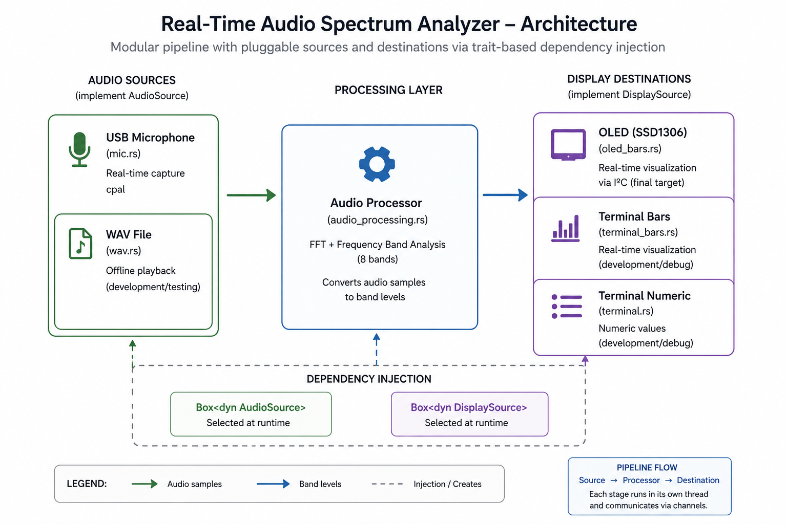

# Real-Time Audio Spectrum Analyzer

A **Rust-based real-time audio spectrum analyzer** designed to capture audio from a **USB microphone**, process it with **FFT**, and display the frequency-band levels on an **SSD1306 OLED display over I²C**.

The project also includes **WAV input** and **terminal display backends**, which were created to support development and debugging before reaching the final **microphone → DSP → OLED** pipeline.

---

# Features

* Real-time audio capture from **USB microphone**
* FFT-based spectral analysis
* 8-band frequency visualization
* OLED display output via **I²C**
* Alternative development backends:

  * **WAV file input**
  * **Terminal numeric display**
  * **Terminal bar visualization**

---

# Architecture

```text
Audio Source (mic / wav) -> FFT Processing -> Display (oled / terminal)
```

Main intended setup:

```text
USB microphone -> Real-time DSP -> SSD1306 OLED (I²C)
```



---

# Project Structure

```text
src/
├─ main.rs
├─ audio/
│  ├─ mod.rs
│  ├─ source.rs
│  ├─ mic.rs
│  └─ wav.rs
├─ display/
│  ├─ mod.rs
│  ├─ source.rs
│  ├─ terminal.rs
│  ├─ terminal_bars.rs
│  └─ oled_bars.rs
├─ audio_processing.rs
└─ utils/
   ├─ mod.rs
   └─ utils.rs
```

---

# Running

```bash
cargo run -- <display> <audio_source>
```

## Display options

* `terminal`
* `bars`
* `oled`

## Audio source options

* `mic`
* `wav`

## Examples

Run with microphone + OLED:

```bash
cargo run -- oled mic
```

Run with microphone + terminal bars:

```bash
cargo run -- bars mic
```

Run with WAV + terminal:

```bash
cargo run -- terminal wav
```

---

# Notes

* The OLED backend is implemented for an **SSD1306 128x64 display** over **I²C**
* The current I²C device path is `/dev/i2c-1`
* WAV and terminal backends are mainly intended for **development and debugging**

---

# Next Steps

* Comprehensive error treatment
* Comprehensive automated tests